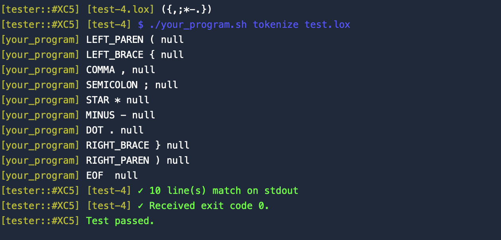
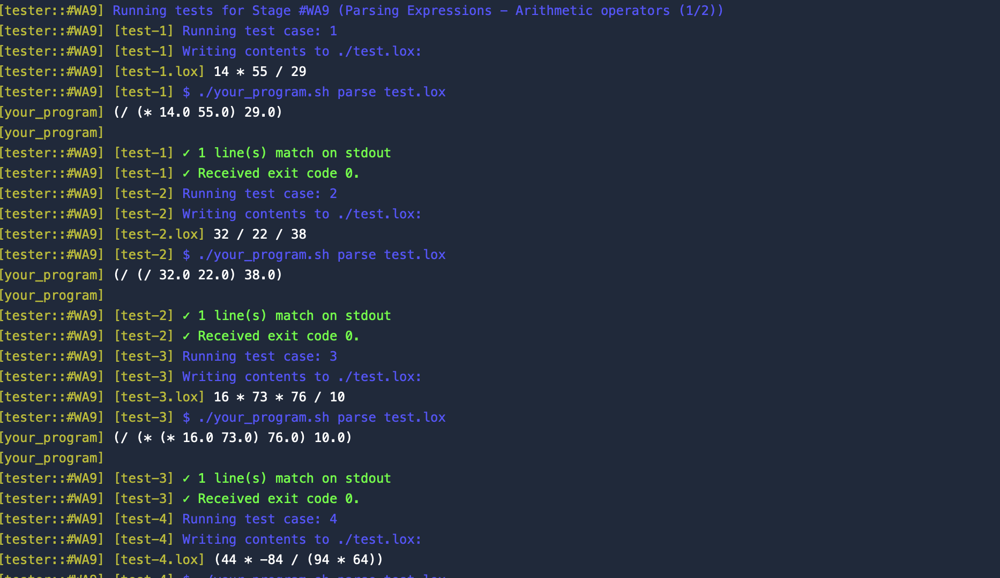
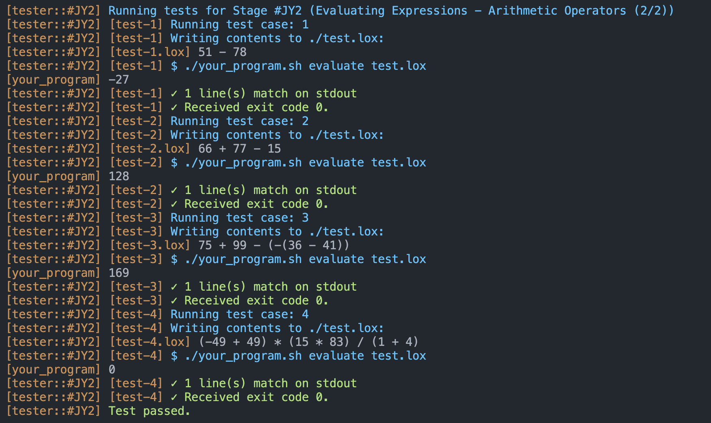
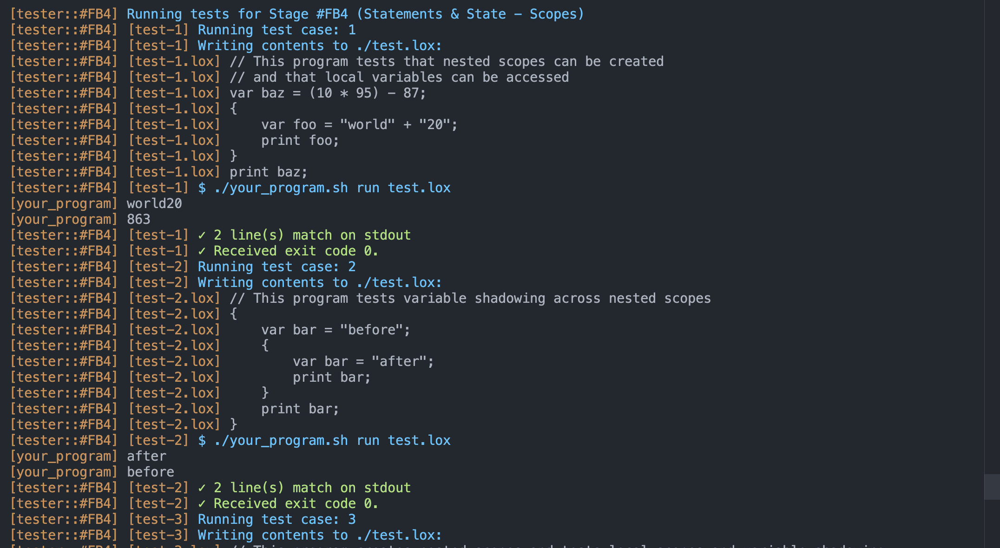

# 🧠 C++ Interpreter

A simple interpreter built in C++ that supports scanning, parsing, evaluating expressions, handling statements, and managing variable scopes. This project was developed as part of a learning journey into building interpreters and understanding how language processors work under the hood.

---

## 🚀 Features

### 1. 🔍 Lexical Analysis (Scanner)
- Breaks source code into **tokens** (lexemes)
- Identifies keywords, identifiers, numbers, operators, and punctuation

### 2. 🧱 Parsing
- Builds a **syntax tree** from the list of tokens
- Supports:
  - Arithmetic expressions (`+`, `-`, `*`, `/`)
  - Grouping with parentheses
  - Variable declarations
  - Assignment statements

### 3. 🧮 Evaluation
- Walks the parsed tree and **evaluates** expressions
- Supports:
  - Integer arithmetic
  - Variable evaluation
  - Expression-based assignments

### 4. 🧾 Statements
- Handles:
  - `let` variable declarations
  - Expression statements
  - Print/output statements (if implemented)

### 5. 🗂️ Scoping
- Variables are stored and resolved using **scopes**
- Supports nested scopes and block-level declarations (if blocks are implemented)

---
## 📸 Screenshots

Below are some screenshots showcasing different stages of the interpreter:

### 🔹 1. Lexical Analysis
Displays the tokens generated after scanning the input source code.



---

### 🔹 2. Parsing
Shows the abstract syntax tree (AST) formed from the parsed expressions.



---

### 🔹 3. Evaluation
Illustrates how the interpreter evaluates expressions and prints results.



---

### 🔹 4. Statement Execution and Scoping
Demonstrates the handling of statements, variable declarations, and nested scopes.



---
## 🛠️ Getting Started

### Prerequisites
- C++17 or higher
- A compiler like `g++` or `clang++`

### Build & Run

```bash
g++ -std=c++17 -o interpreter main.cpp
./interpreter

